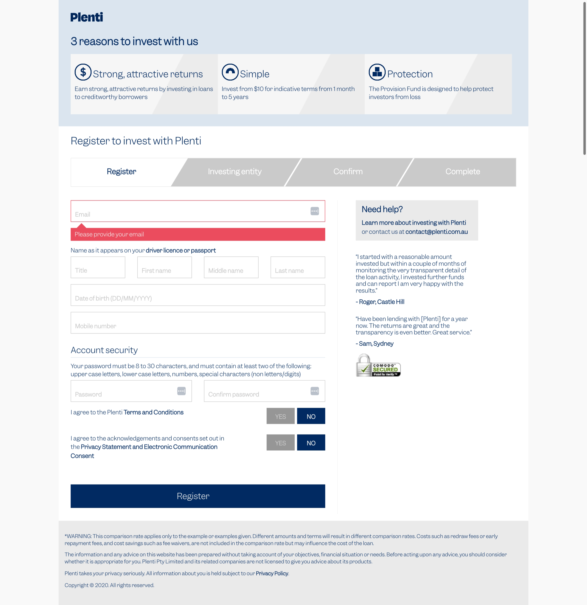
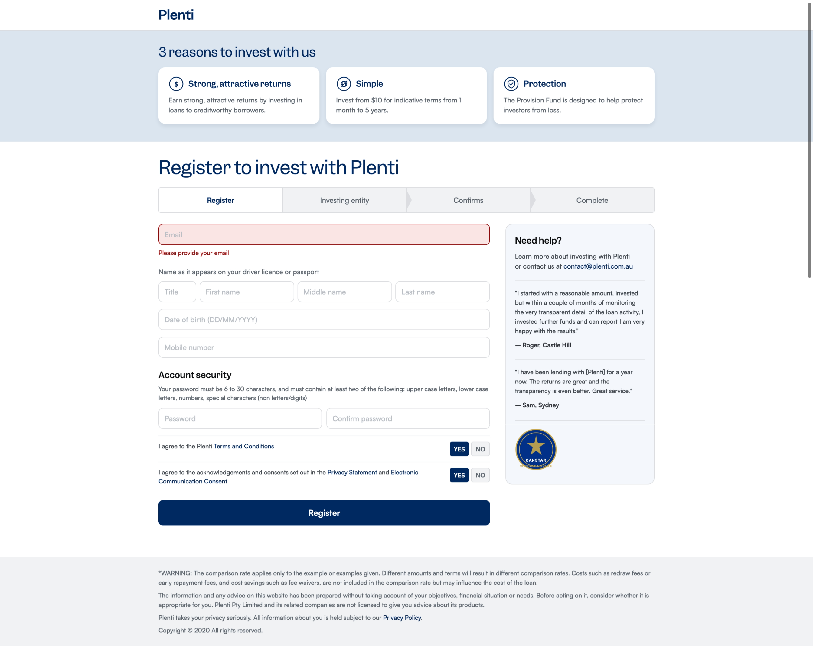

# Plenti Site Analysis

## About

This project reverse-engineers the [Plenti](https://www.plenti.com.au) website to extract its design system and faithfully rebuild pages from it. The workflow covers three stages: downloading the live site for local inspection, extracting a structured design system (typography, colours, spacing, components, and layout patterns), and then rebuilding a target page as clean HTML that conforms to those standards.

The goal is to produce a reliable reference for replicating Plenti's visual and structural conventions — useful for prototyping new pages, auditing consistency, or migrating to a new front-end stack while keeping the look and feel intact.

## Skills

Structured extraction and analysis skills live in [skills/](./skills/).

---

## Step 1: Downloading the Existing Website

Use `wget` to recursively download the site for local analysis.

**Download entire site:**

```bash
wget --recursive --no-clobber --page-requisites --html-extension \
     --convert-links --restrict-file-names=windows \
     --domains www.plenti.com.au --no-parent \
     https://www.plenti.com.au
```

**Download personal loans section:**

```bash
wget --recursive --no-clobber --page-requisites --html-extension \
     --convert-links --restrict-file-names=windows \
     --domains www.plenti.com.au --no-parent \
     https://www.plenti.com.au/personal-loans
```

**Download repayment calculator page:**

```bash
wget --recursive --no-clobber --page-requisites --html-extension \
     --convert-links --restrict-file-names=windows \
     --domains www.plenti.com.au --no-parent \
     https://www.plenti.com.au/personal-loans/personal-loan-repayment-calculator
```


---

## Step 2: Extract the Design System

Run [Skill 01 — Design System Extraction](./skills/01-design-system-extraction.md) against the downloaded files in `docs/resources/`.

> "Run skill 01 on the downloaded Plenti files in `docs/resources/`"

Output is saved to `docs/design-system.md`.


## Step 3: Rebuild Existing Page to Conform to Standard

Build an HTML page in the `sample/` folder based on `sample/old.png`, using `docs/design-system.md` as a reference to conform to the design system's layout and styles.

**Original (old.png):**



**Rebuilt (new.png):**

